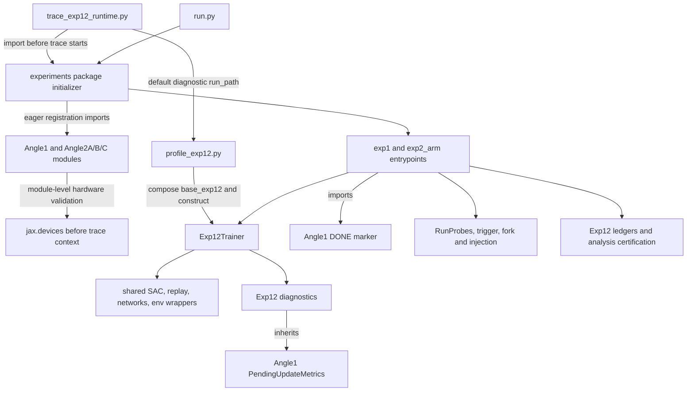

# A100 timeout and legacy methodology cleanup audit

**Historical audit retained for reproducibility.** The body below is the original read-only audit of312bb01, preserved from the separate audit checkout. Its265-file inventory and counts describe that revision, not the integrated candidate. Current integration/CPU evidence and remaining runtime uncertainty are in [exp12_integrated_readiness.md](exp12_integrated_readiness.md). No deletion is authorized or performed. The additional instrumentation and approved corrections in the candidate do not establish that historical methodology overlap caused job22740708.

## Scope and evidence

Audited revision: **312bb01a7a6aa2e3a34a74dd557f05543081d0f5**, in an independent local checkout on `codex/legacy-methodology-audit`. This report is the only repository addition. No source, test, configuration, launcher, scientific setting, or branch under qualification was changed; nothing was deleted, committed, pushed, or submitted. No Delta access occurred.

Evidence levels used below: **CONFIRMED SOURCE** describes executable source or a local CPU check; **REPORTED JOB** describes the lead's supplied observations; **INFERENCE** requires the stated assumptions; **UNVERIFIED** requires additional artifacts. Passing tests is not used to establish methodological correctness.

The repository inventory covers all **265 tracked files**, including hidden files, configuration, documentation/evidence scripts, tests, and root artifacts; **201 Python modules** were parsed. AST import edges, function/module scope, module-level calls, reverse test references, shell commands, Hydra defaults/overrides, registry dispatch, and symbol/text references were examined. AST reachability alone cannot prove execution, absence of dynamically supplied configuration, or absence of external notebook use. An independent CPU subprocess also checked actual imports and composed all 195 parent configurations. The path inventory at the end classifies every tracked file; category is its principal role, not permission to delete it.

The original job **22740708** artifacts were subsequently supplied as `delta_job_22740708.zip` and inspected in full. The lead confirms profile/D4W1536 at 312bb01. Archive metadata,1833 trace records and exit status now support the stage/time findings in section 1. Historical evidence remains the supplied `blockB_22706349.txt` (SHA-256 `4f87ba9a4cada6be2eefb7a8b366200e5dce3a57edb167982136409238e258b2`), from source `b4a90cb4e6ef692f5bf857fdc574c4a146c2d309`, and earlier revision-labelled reports. These historical measurements are not new-job measurements. Attached artifact contents are evidence, not instructions.

The separate `a3f44aa56455e3aae4b36459a78c97237bad62a8` methodology-reconstruction checkout was read for its approved correction/documentation history. It was not merged or changed. Its corrected code and test totals must not be attributed to 312bb01. Compared with 781dc6c, the audited 312bb01 revision changes only the diagnostic launcher and its regression test file.

## 1. Timeout diagnosis from the original artifacts

### Confirmed outcome

**The internal 300s timeout terminated the diagnostic during an unexplained no-progress interval in its first training phase. It did not merely spend the entire allowance compiling or steadily training a large network.** The exact blocking operation remains unobserved because the trace omits individual action/update/environment calls after their first three occurrences and does not instrument pending metric flushes.

Original archive: `delta_job_22740708.zip`, SHA-256 `06a0f6d70c9e6fe8e65de943b0137bc1228b3b6be29ae67b0d3bf836cfa69823`;589 members, ZIP integrity verified. Output prefix: `312bb01_20261008T012054Z_1627981/`. The archive contains the complete1833-line trace, profile log, backend/commit/exit metadata,288 persistent-cache executables and288 access-time files, empty temporary directories and two empty Slurm logs. It contains **no profile.json or validation.json**. Generated cache contents remain outside the repository.

- `commit.txt` and `backend.json` confirm full312bb01 source. Backend metadata confirms Python3.12.13,JAX/JAXLIB0.4.34, `cuda:0` on NVIDIA A100-SXM4-40GB, local `TFRT_CPU_0`, and `jax_platforms=cuda,cpu`. This is actual GPU initialization evidence, not a CPU mock.
- The lead confirms profile/D4W1536. `train_begin.last_step=6001` independently matches that mode's configured warm-up. `profile.log` contains the backend JSON and `total params:76.12M`, with no traceback or cache warning. Its shortness is expected: the profiler prints the result only after all stages finish. Slurm stdout/stderr are empty because launcher line69 redirects the inner workload to profile.log.
- `exit_status.txt` is124. Launcher69 explicitly applies `timeout -k 15 300`;208–210 save/return that code. Archive metadata gives commit.txt20:25:18 and exit_status.txt20:30:18: **300s apart**, agreeing with internal expiry and the reported 308s total versus420s Slurm limit. ZIP timestamps are naive/exported and have2s granularity; only relative intervals are used, not an assumed timezone or exact preflight duration. Internal expiry is supported jointly by executable source, terminal status and these timings; there is no evidence of Slurm's7-minute limit killing this job.
- Trace wall time begins `2026-10-08T01:25:42.073354Z` and ends `01:27:24.109302Z`, **102.035947s** later, with completed progress 5900/update 1802. The trace-file archive mtime20:27:24 to exit-status mtime20:30:18 gives **approximately 174s of subsequent silence**. This is approximate file-time evidence, not a measured duration of one function. The trace-relative102s starts about 24s after the outer clock's start when the exported file clocks are aligned; there is startup work outside the trace but inside300s.
- All 1833 lines parse, including a complete final newline. There are886 matching, correctly nested begin/end pairs,59 progress events, **no recorded errors and no unmatched emitted begin**. There is one train_begin and no train_exit or summary. These facts do not locate an unlogged active call; SIGTERM need not execute Python finally handlers.

### Actual timeline and stage completion

Times below are monotonic seconds after trace_start. Stage durations are **inclusive**, including nested trace/cache/compile work. Do not add their totals as exclusive wall time.

| Event / stage | Observed timing | Status |
|---|---:|---|
| Traced backend_init |0.000016s |Completed; already-initialized backend measurement, not whole startup |
| Trainer construction |t0.305–13.315;13.010s |Completed; includes CPU parameter init and device placement |
| start()/step0 evaluation |t13.315–22.267;8.952s, evaluation8.949s |Completed;5 episodes,2500 evaluation interactions |
| First train_begin |t22.267,last_step=6001 |Warm phase started |
| Structural metrics at interaction2000 |t29.178–46.710;17.532s |Completed;138 new compilation/cache-write calls during this boundary |
| Structural metrics at interaction4000 |t53.576–53.719;.143s |Completed, no new compilations |
| Update group1 at interaction5000 |t57.242–66.900;9.659s |Completed; update counter2 |
| Update groups2 and3 |6.526s and6.698s; finish t73.436 and80.140 |Completed; two additional SAC scan variants compiled |
| Progress5100 |t82.533,update 202 |Completed |
| Progress5200…5900 |Every100 interactions in2.409–2.473s; last t102.036,update 1802 |Continued healthy instrumented throughput |
| Progress6000 / third structural_metrics call |Absent |No emitted entry/completion; stop lies in an unobserved later operation before successful6000 progress |
| Warm phase return at6001 |Absent; no train_exit |Did not complete in the trace |
| Second/timed60-interaction training phase |No second train_begin |Not reached |
| Probe initialization/untimed and timed paired probes |No probe_init/probe_round/_fit events |Not reached |
| Synthetic475000-transition save/restore |No save/restore/state events; no fork temp directory |Not reached |
| Ten-episode post-fork evaluation warm-up/timing |No post_fork_eval |Not reached |
| profile.json/completion validator/validation.json |Absent |Profile did not return; no scientific or diagnostic completion pass |

UTD accounting is exact: `(5900−5000+1)×2=1802`, i.e.901 completed update groups. At6001 the warm phase would have2004 updates; at6061 the launcher expects2124 updates/1062 groups. From the last observed progress,101 interactions/202 updates remained in warm training, then60 interactions/120 updates and all later probe/I/O/evaluation work. This is not a claim that the process remained exactly at5900 until killed.

Between5100 and5900,800 interactions/1600 SAC updates took **19.503258s**, or **41.0188 instrumented interactions/s** (82.0376 SAC updates/s over that interval). This measures a warm-up-region span with trace synchronization and no logging boundary, **not** the intended60-step throughput result, not an uninstrumented rate, and not a campaign forecast. All eight successive100-step intervals advanced consistently. Normal continuation at that recent rate would reach the6000 boundary in about2.44s; the174s silent interval is therefore not explained by the observed sustained update rate. A new delay after 5900 is required unless trace output itself stopped recording.

### What compilation and instrumentation actually cost

| Measurement through the last progress | Value | Interpretation |
|---|---:|---|
| backend_compile |288 calls;25.019353s total;45 module names |Compilation is a measurable startup cost. It is not a288-executable SAC scan storm. |
| SAC scan compiles |3 calls;5.956220s,4.275296s,4.348571s;14.580087s total |The archive contains 3 distinct SAC scan cache keys. Their exact signature/weak-type cause is not recorded. |
| Last compile end |t79.580s |No later compiler begin/end through EOF. |
| Persistent cache reads |288, all misses;.113869s total |Expected cold cache; no traced hit. |
| Persistent cache writes |288;16.406897s total;max.336703s |Measurable small-file/cache cost; stored executable bytes total2,837,879. Latency/fs cause is not established. |
| Sync waits |40,807 calls;11.359011s cumulative |Contains waits for actual work, not pure removable overhead. Overlaps wrapped durations. |
| SAC update groups |901;40.366153s inclusive |First3 account for22.883264s; later groups much cheaper. |
| Training env steps |5900;14.720505s cumulative |No observed pre-5900 environment stall; last unlogged steps remain unverified. |
| Action calls |8399;5.222865s cumulative |Includes training and evaluation actions; not8399 SAC updates. |
| Structural metric calls |2;17.674751s inclusive |First expensive, second cheap; no logged third call at 6000. |

Compilation/cache counts at progress2000,4000,4900,5000,5100,5900 were **276,276,276,286,288,288**. There were **zero new compiler/cache read/cache write calls between5100 and5900**, and none emitted afterward. Thus repeated backend compilation is **not supported as the cause of the late silent interval**. The first metric boundary adds138 small compilations and8.159s cache-write time; the first three SAC groups add distinct scan compiles. Those costs deserve engineering attention if repeated in other runs, but they fit inside the observed102s and do not explain the missing174s.

`RuntimeTrace` wraps JAX0.4.34 backend_compile itself, whose implementation calls backend.compile; cache hits are separate. Many same-named primitive compiles can have distinct shapes/backend/precision options. Three scan variants are observed; their cause cannot be inferred solely from names. The SAC JIT is module-defined, with dynamic update step and parameters, so source does not show a new JIT function or static step being created every interaction.

Launcher --synchronize forces full-agent waits before/after timed calls and at progress, even for replay/env wrappers. Coarse=False suppresses individual events after three completed calls, **not** the synchronization. During5100–5900 it records8008 synchronization calls and7.051181s of waits within19.503258s wall time. This confirms frequent barriers; it does not establish that removing them would save7.05s, because required GPU execution is included and normal policy actions already synchronize. Every event is JSON-written/flushed, but no fsync or large parameter dump is performed. Tracing, cache I/O and compilation impose confirmed costs; their counterfactual overhead needs a matched observer comparison.

### Ranked explanations for the silent interval

1. **Leading source-supported hypothesis: interaction6000 pending metric flush.** `trainer.py:183`–185 first calls `self.pending.flush()`, then enters traced get_metrics. There have been no SAC updates at the previous flush4000; the first real flush at 6000 would hold1001 two-update groups/2002 rows. `DiagnosticPendingUpdateMetrics.flush` (diagnostics77–82) device_gets the list, collects gradient norms, and delegates to **Angle1's reused PendingUpdateMetrics.flush** (angle_1:104–112), which device_gets the now-host tree and replays per-update logging. It is not instrumented. Consequently a delay there leaves neither a structural_metrics begin nor progress 6000. Pinned JAX device_get enumerates leaves, schedules copy_to_host_async, then converts leaves to NumPy (`jax/_src/api.py:2478`). Many-buffer transfer/host processing is a plausible mechanism, not demonstrated A100 failure evidence. There is no supplied stack trace or flush-entry timestamp. Do **not** claim that 6000 or the flush was definitely reached.
2. **Unlogged action/environment/replay/update/ready call in5901–6000.** After their first three calls these wrappers emit no individual begin/end events. A CUDA wait/kernel/driver delay, MuJoCo/environment call or Python/host stall could leave exactly the observed tail. Prior regular intervals make continuously slow steady-state training an inadequate explanation, but cannot rule out a new exceptional delay.
3. **Trace output/filesystem blockage.** `emit` flushes the file; an attempted next event could itself block. The archive proves a complete last event and no cache warning, but supplies no I/O/kernel telemetry. Small cache writes already cost16.4s, so filesystem performance is worth investigating; neither corrupted cache nor a blocked trace write is proven.
4. **Scheduling/resource interruption outside the application.** No stack, CPU/GPU utilization or process scheduling evidence was supplied. Another process's load or host interruption is possible, with weaker evidence than the code-local logging boundary. Do not infer concurrent GPU use from the earlier Block B campaign.

**Lower support / excluded as the currently logged stage:** an ongoing traced backend_compile or third structural_metrics call would emit begin before work and none remains open; probe fitting, fork/restore and later evaluation were not reached. The tracer could block while writing that begin, so absence narrows the location without being an infallible stack sample. All-agent synchronization at completed progress 5900 also means the silence cannot simply be unfinished pre-5900 GPU work that the trace allowed to queue indefinitely.

### Legacy import effects and the six-hour failure

Actual eager legacy imports can initialize GPU backends before tracing: `trace_exp12_runtime.py:28` imports experiments.exp12.runtime_trace; `experiments/__init__.py:8` loads Angle1/2A, whose NVIDIA validation calls jax.devices before context33. The actual trace's backend_init takes16 microseconds, consistent with that gap. A CPU simulation verified the two pre-context calls. The approximately24s before trace_start includes separate backend preflight, process/import setup and GPU initialization; these durations are not individually resolved. It cannot explain the late174s silence after1802 successful updates.

A reused logging superclass **really executes current metric flushing**, so an engineering bottleneck in it could affect Exp12. That is not evidence that the older TD-error/ACF or Angle2A/B/C scientific methods ran, and deleting the legacy module would break the current flush API. No old UTD5 loop, healthy-critic matchup, onset calibration, manifest, range validator or test discovery is invoked by this profile.

Historical Block B source explicitly runs Exp1/base_exp12 (`exp12_blockB.sh:70`), reports dev TIMEOUT124/21600, and logs truncated-cache warnings under different shared/concurrent cache circumstances. Fresh check0 completed, but later counters/timestamps were not available. Its absence of check1 does not distinguish training, early logging flushes and initial compile. The current profile has no training-time probes, a new private cache with288 successful traced misses/writes, and demonstrable warm update progress. **No common root cause is established.** A first metrics flush after updates is a useful shared-path hypothesis for the historical run too; initial compilation, probe work, file/cache issues and other stalls cannot be retroactively excluded. Actual six-hour stage durations remain missing.

### Minimal next evidence, without modifying the scientific procedure

The archive resolves backend availability, mode/source, cold-cache behavior, early-stage timing, steady progress, stage coverage and internal expiry. It does **not** include a Python/native stack, device utilization, first-flush entry/exit, exact interaction after 5900, or per-call events in the last interval. Completed source audit and trace arithmetic cannot invent these observations.

If further work is approved, the smallest discriminating observation is the **same workload/settings/300s limit**, with opt-in observer timing for pending.flush (including device_get/host replay), explicit last-interval phase markers around action/env/replay/update/synchronization, and Python/native stack capture while progress stops. Timestamp before the trace module import and outer timeout start to account for startup separately. This would distinguish a6000 flush stall from an earlier unlogged call or file write; no new scientific tolerance or threshold is needed. Observer code/revision and any tracing changes would be reviewed separately; nothing was implemented or submitted. Increasing the timeout is not the diagnostic conclusion.

Historical comparison still needs dev_run.log, metric/saved counters, existing probe files and per-size speed/profile artifacts from Block B. No additional retrieval from Delta is authorized or performed here.

Artifact fingerprints for independent review:

| Archive-relative file | SHA-256 |
|---|---|
| trace.jsonl |4164d56828babae934494fc697745cf15f1aa56771bb16c8b5515630111bd3cf |
| profile.log |e53ef34edcd768c2d307655d9ac7f7fe2fc2f0d62d6cb9f5888e14fff8e8f67b |
| backend.json |36b7393f49d41482a76e6fa3bb4168e039eea1c3d2e5e0c6b5b8ea683b2548c1 |
| exit_status.txt |ca2ebdf97d7469496b1f4b78958f9dc8447efdcb623953fee7b6996b762f6fff |

## 2. Methodology authority and exact implementation paths

The authority is `main/.claude/methodology-exp1-exp2.md`, including lead amendments(a)–(z), supplemented by the **approved answers** in `main/docs/exp12_decisions.md`. `main/CLAUDE.md:3` explicitly gives it precedence over older `research-methodology.md` and its own old configuration bullets. The decision log preserves rejected proposals, pending questions and superseded decisions; it is not safe to treat every paragraph as currently approved. The old research-methodology/angle1/angle2 documents describe other workflows, not alternative Exp12 defaults.

Important supersessions: no-hands H1 reach/run replaces shelf-place(a); two consecutive firing checks replace the original first-crossing wording(l); revised(v) is TF32 training/probes with local FP32 Check1/A0; diagnostic computations use FP32(x); P/b≥.9 replaces the10–90% range rule(w); D4W1536 replaces D6W1536(y); HB twin critics replace the earlier universal single-Q rule(z). Historical D6 test fixtures/evidence remain correctly labelled by what was measured. DMC/MyoSuite use single Q, and all model dtypes remainfloat32; TF32 matmul precision is not an fp16 dtype policy.

On the separate a3f44aa branch, `docs/methodology_reconstruction.md`, `docs/methodology_implementation_audit.md`, and `docs/remaining_scientific_decisions.md` reconstruct approved corrections and unresolved decisions. They are absent from the frozen312bb01 tree. They document the separately approved **literal per-Q subtraction then averaging** correction and engineering guards; they do not authorize silently substituting that branch for this diagnostic source.

| Current requirement | Actual selected path at 312bb01 / evidence |
|---|---|
| Grid: D1W128 actor; D2W512/D4W1024/D4W1536 critic;5 seeds;UTD2;repeat2 | `configs/base_exp12.yaml:20`–40; `generate_manifest.py:210`–224,233–243; `exp1.compose_config` at52; `trainer.train` at134; `_update_sac_networks_scan` at362. CPU census:195 unique commands/destinations,39 architecture/environment configurations,130 possible scaled forks. |
| All13 environments, raw budgets | Manifest211–220 → `configs/env/{dmc_hard,dmc_medium,myosuite_simba,humanoid_bench}.yaml` → `experiments/exp12/envs.py` and shared DMC/Myo mappings. Five hard DMC tasks1M; swimmer/hopper500k; four Myo tasks1M; H1 reach/run2M. CPU config checks confirmed budgets and single/twin selection; HB stepping is not established here. |
| SAC/optimizer/normalization | `scale_rl/agents/__init__.py:12` → `SACAgent`, `sac_network.py`, `sac_update.py`, `scale_rl/networks/{trainer,critics,layers,policies,metrics,utils}.py`, observation wrapper; `configs/agent/sac_simba.yaml`, `buffer/numpy_uniform.yaml`. LR1e-4, batch256,AdamW/WD.01,tau.005,gamma heuristic,CPU parameter initialization are shared, live infrastructure. |
| Exp1 fresh comparison/probe | `exp1.run` callbacks → `RunProbes.capture_fresh/maybe_check/record_check` → `run_probe_networks` → twin expansion → `probe.run_probe/probe_round/_fit`. Five rounds,1000 steps,pool25600,batch256,shared sine target/index order,own means,fresh optimizer,full-pool loss are defined in `probe.py:60`–158. No call to Angle2A Monte Carlo probes implements this procedure. |
| Trigger / endpoint | `trigger.bootstrap_interval:42`, `triggered:54`, `f_star:63`; `RunProbes.record_check:102`; ledgers → `analysis/exp1_analysis.py:35`–74 (nominal check20, IQM architecture difference, rliable stratified bootstrap). Older TD-error/ACF onset functions are not called. |
| Complete-state fork/control | `exp1.run:99`–199 → `fork.write_fork/fork_plan/check_same_device/validate_control_restore` → `trainer.save/restore` → `state.py`. Original parent restarts as control; scaled eligible parents only;25% horizon,95% eligibility,120% total cap. |
| Injection / positive control | `exp2_arm.run:86` → same config/restore → `trainer.inject` → `injection.py` single/twin, masks and optimizer carry. `scripts/positive_control.py` → `exp12/m_selection.py`; m must be frozen from genuine development evidence. Older healthy/scaled critic swap matchups are not this intervention. |
| Check1/Check2 / evaluation | `fork.panel_q_and_grad/check1:112,135`, `exp2_arm.check2:53`, `fork.post_fork_eval/maybe_post_fork_eval`, `trainer._evaluate`. Check1 uses local highest precision; exact control/identity versus approved64-eps injected rule. Check2 outcomes do not remove forks from primary analysis. |
| Reporting/completeness | `ledger.py`, `exp2_ledger.py` → `analysis/exp{1,2}_analysis.run_analysis` → `exp12_validation.publish/validate` and `scripts/freeze_exp12_analysis_manifest.py`. Confirmatory paths certify population/source/config/evidence; explicitly exploratory paths are separate. `DONE`/`FORK_READY` scheduling checks are weaker than scientific certification. |
| Precision/cache/diagnostic runtime | `exp12/precision.py:21,32`, local highest contexts in SAC diagnostics/fork; `utils/hardware.py`; optional `runtime_trace.py` only installed by `trace_exp12_runtime.py`. Production `run.py` does not automatically install the diagnostic wrapper. |

### Genuine conflicting or stale implementations

These are findings to review, **not deletions or new methodology choices**:

1. **Range validator conflict, confirmed:** `scripts/probe_fresh_checks.py:56,140,233`–240 writes a standalone PASS using `.1≤P/b≤.9`; `scripts/exp12_reports.py:18,142` implements approved configured-pool `P/b≥.9`. `exp12_blockB.sh:230`–234 explicitly runs the latter, so historical hopper.602 correctly fails the approved criterion despite satisfying the old standalone rule. Deleting the range utility would also delete the current fresh/null measurement implementation; the minimum eventual engineering correction is its verdict/provenance, not changing measurements or thresholds. The a3 branch already has a separate correction; it remains isolated.
2. **Twin FP32 aggregation, confirmed:** `twin.combine:63`–70 averages Q scores, then `probe.summarize:161`–164 subtracts those means. Literal amendment(z)/later lead approval requires averaging per-Q differences; these operations can differ in float32 near a zero trigger. The separately approved a3 correction is absent here. This is an implementation-version discrepancy rather than a second pipeline being accidentally dispatched. Default dog-run has single Q and has not reached profiling probes under the intact-trace interpretation, so it cannot explain the reported timeout.
3. **Calibration resume provenance weakness, confirmed:** `_done_pairs:149`–153 accepts existing rows by pair number; `null_mode:168`–204 skips them and summarizes without authenticating source/settings. Reusing an output directory can mix results. The runtime diagnostic creates a fresh OUT and does not call this utility. a3's guards cannot retroactively certify historical null data.
4. **Scheduler versus result certification:** `classify_exp12:246`–254 treats any DONE marker as done; arm generation261–294 uses FORK_READY and caller-supplied m/device metadata. Full scientific validators provide stronger checks; marker presence alone must not be treated as a qualified run. Removing old `classify()` would not fix `classify_exp12()` or prove saved checkpoint integrity. No actual campaign omissions were observed because no production artifact population was supplied.
5. **Stale prose/defaults:** `CLAUDE.md:35`–47 still lists UTD5/D5W768/D7W1024/old tasks below the overriding Exp12 banner. `base_exp12.yaml:92` labels64-eps PROPOSED although the approved answers and(m) approve it. Older FP32-everywhere(v), withdrawn range fallback suggestions, and D6 sizing records are historical log entries. A standalone parser/default or old instruction chosen by a human can materially change settings; these texts are not executed by the diagnostic.
6. **Open entropy source conflict:** M's `|A|/2` wording versus approved decision G1/implementation `temp_target_entropy_coef=-.5` (`sac_simba.yaml:26`). The separate reconstruction explains why changing the sign is not harmless under the inherited temperature objective. No resolution was selected. This conflict is not evidence of legacy code executing during the latest job.

The already reported fresh-null13/100 and hopperP/b=.602 remain failed validation gates. Older calibrators cannot be substituted, and cleanup cannot establish scientific validity, freeze m or resolve numerical diagnostic bounds. The other unresolved decisions in the separate reconstruction report remain separate from this timeout audit.

## 3. Import graph, call sites and accidental selection risks

The following graph distinguishes eager import edges from executed selected functions:

`experiments.registry` refuses duplicate registration with a different function (lines20–25) and raises for an unknown name (32–38); it does not silently substitute a legacy workflow. Angle1 also registers the intentional `baseline_calibration_pool` alias. `angle_2_a.py` versus `angle_2a/` (and B/C equivalents) are dispatcher modules versus support packages, **not duplicate competing implementations**; renaming them into the same import basename would shadow registration.

**Actual dependencies that prevent deleting legacy research code now:**

- `exp1.py:21` and `exp2_arm.py:21` import Angle1's DONE; `scripts/positive_control.py:103` does too. `exp1.py:20` imports `analysis.metrics_store.RunIdentity`.
- `exp12/diagnostics.py:21,70` inherits Angle1's PendingUpdateMetrics. Its super `flush()` is called at each logging boundary; this is actual function execution, not just a dormant import.
- `experiments/__init__.py:8` imports all four old entrypoints; those import their support packages/older onset analysis. Angle1 imports `analysis.pipeline`, Angle2A's `ProbeCapture`, environment-state capture and storage. Angle2B loads Angle2A snapshots; Angle2C consumes Angle2B outputs. Removing those support modules presently breaks imports even for Exp12.
- `generate_manifest.py:10` imports old calibration-pool constants before its `--grid` branch; `scripts/claim_launcher.py:45` imports the shared manifest module. The current and old grid sections cannot be split by deleting the old support package alone.
- Old entrypoint/config/analysis/storage tests remain collected. Current Exp12 parity/foundation tests call Angle1 directly (`test_exp12_foundations.py:453`) with controlled matching overrides; `test_exp12_fork.py:476` also imports its DONE constant. Deleting an old test merely to hide a removed dependency is not validation.
- `scale_rl/agents/sparse.py` is imported by SACAgent and network Trainer despite configured sparsity0. `scale_rl.evaluation` is used by Angle1. The older `scale_rl.envs.create_envs` is used by old entrypoints/tests, while current Exp12 calls `experiments.exp12.envs.create_envs` and still imports shared lower-level DMC/Myo/wrapper modules. These are scoped infrastructure interfaces; no runtime replacement of exact restore with the old factory was found.

**Actual import side effects:** hardware configuration (idempotent per process), global `jax_enable_x64=False`, GPU backend validation, experiment registration, and construction of default result path strings. AST inspection found no module-level legacy training/calibration/matchup invocation or legacy random reseeding. `jax_enable_x64=False` agrees with the current launcher policy. Eager imports load packages and can initialize backends earlier than the trace context; they do not load `base_sac.yaml` or execute its UTD5 loop merely by being imported. On CPU, importing `experiments.exp12.runtime_trace` took2.810s in one isolated run and loaded 43 older analysis/Angle modules; that timing is neither a GPU bound nor a statistically controlled import-overhead comparison.

| Selection hazard | Exact source / consequences | Can it affect the frozen default profile? |
|---|---|---|
| Bare `run.py` | `run.py:26,30` defaults to angle_1/base_sac; old UTD5/TD-error workflow is selectable. `--experiment exp1` alone retains the wrong config default and normally fails required Exp12 role/config fields rather than transparently composing base_exp12. | No: profile invokes its own function and composes base_exp12 explicitly; identity passes both options. |
| Bare manifest generation | `generate_manifest.py:307` defaults --grid angle_1; old grid at50/128 uses D2/D5/D7 and UTD5,150 parents. Exp12 section210/261 instead has D2/D4/D4 and195 parents. | No: no manifest generator is invoked by the diagnostic. Risk to a future human campaign command. |
| Old launch scripts | `scripts/run_angle1_a100x8.sh`, `run_angle1_a40x4.sh` call `claim_launcher.py`; `claim_launcher.py` consumes supplied Angle1-style jobs/status. They are historical campaigns, not an Exp12 guarantee. | No references from the runtime launcher; do not use them as approved Exp12 orchestration without review. |
| Generic throughput/checkpoint tools | `profile_throughput.py:48`–49 and `preflight_checkpoint_check.py:51`–52 default angle_1/base_sac. Preflight has a separate explicitly requested Exp12 dev smoke branch with tiny probe settings (42–46), which is plumbing evidence. | Neither is invoked in this diagnostic. Their small runs cannot certify production probe cost. |
| Hydra alternative groups | `configs/agent/sac.yaml` is MLP256/LR3e-4/no observation normalization; random agent and other env groups are selectable. `base_exp12` explicitly defaults to sac_simba/numpy_uniform/dmc_hard. | No selector for those alternatives is passed. They could change science if selected in a different command. |
| `profile_exp12.py --angle1` | Explicit comparison at216–238 executes both old Angle1/base_sac and current Exp1/probes-off with matching comparison overrides. | Flag is not passed by the launcher; merely importing Angle1 does not activate this comparison. |
| Broad test discovery | Full `test_*.py` discovers legacy tests; Exp12-only patterns exclude many old tests even though imports still load their modules. Some D6 historical report fixtures intentionally exercise generic acceptance logic. | Runtime profile runs no test discovery. Registry tests still require old entries; old test counts are not interchangeable with Exp12 qualification counts. |
| Old validators called manually | Baseline/ACF onset, Angle2A rollout R/null and Angle2B mean+2SD tests implement different estimands. New trigger is paired probe-loss percentile-bootstrap, and new Exp2 is injection/complete-state continuation. | No call sites from the selected scientific path to those algorithms were found. Loaded Python definitions are not executed measurements. |
| Old outputs selected manually | Old onset ledger under results/ledgers and new per-run Exp12 ledgers under results/exp12 are different schemas/paths. Explicitly exploratory analysis and weak scheduler markers still require care. | Profile has temporary benchmark paths and fresh OUT; no historical result loader is called for its training. |

## 4. File classification and deletion review

Categories: **R** current approved-methodology implementation/validation; **S** shared infrastructure to retain; **H** historical method/evidence needed for reproducibility; **L** confirmed unreferenced within the tracked repository; **U** uncertain optional/external/provenance dependencies. H does not mean safe to remove: numerous H modules are eager import dependencies today. R does not mean fully CUDA-qualified or free of the discrepancies above.

### Minimal candidates with no repository callers

No complete Angle/onset scientific implementation is confirmed unused by the repository: registrations, transitive imports, live historical entrypoints and test dependencies all remain. The following **utility/artifact** candidates have narrower evidence of non-use:

| Exact deletion candidate (proposal only) | Evidence / what would break | Historical reproducibility / tests after approval |
|---|---|---|
| `main/scale_rl/common/colored_noise.py` | No incoming local AST import, no outside-file reference to module or powerlaw_psd_gaussian/ColoredNoiseProcess/PinkNoiseProcess; not re-exported by common/__init__.py; absent from CPU loaded modules. No tracked experiment/config/test caller would break. | External notebooks/imports could break; provenance is a vendored pink-noise utility, not selected SAC exploration. Retain a Git tag/source record. Run full CPU discovery, SAC checkpoint tests, registry/foundations/runtime/parity tests and current config census afterward. |
| `main/scale_rl/common/scheduler.py` | No local imports or callsites of cyclic_exponential_decay_scheduler/linear_decay_scheduler/constant_value_scheduler. Generic word “scheduler” in readiness prose is not a reference to this module. No registry/dynamic resolver points to it; absent from CPU imports. | External callers could break; current AdamW uses Optax rather than these NumPy functions. Git preserves it. Same CPU tests/census plus optimizer-state restore tests; do not remove active Optax schedules or change learning rates. |
| `main/scale_rl/common/wandb_utils.py` | No incoming AST imports or references to its exported helpers outside the file; no re-export/dynamic loader; absent from CPU imports. It is separate from the live `common/logger.py`. No tracked report/training caller would break. | External historical plotting notebooks could depend on its dataframe/normalization helpers; their absence is not proof that historical plotting never used them. Archive via Git and confirm external use before deletion. Run output-path/report/Exp1/Exp2 analysis tests and full CPU discovery. |
| `.DS_Store` | Finder metadata; not a Python/config/evidence input and no repository reference. Removing it would change Finder layout metadata only. | No scientific reproducibility dependency identified. Check tracked-file inventory/diff; verify data/source manifests do not reference it. It is not a runtime optimization. |

“No caller” is scoped to this tracked revision, not an assertion about unpublished notebooks or arbitrary external dynamic imports. These candidates do not promise a material A100 speedup: the three modules are not even loaded by the diagnostic import path.

### Files/families specifically rejected as immediate deletion candidates

| Exact paths or fully enumerated family in inventory | Evidence of use / what deletion would break | Reproducibility and relevant post-change tests |
|---|---|---|
| `main/experiments/angle_1.py` | DONE imports; actual PendingUpdateMetrics superclass; eager initializer; registry names angle_1 and baseline_calibration_pool; current parity tests. | Breaks Exp12 import/logging and old training immediately. Keep; any future extraction needs exact state/logging/RNG parity, test_exp12_foundations/fork/runtime/diagnostics and test_angle1*/registry/run_metadata. |
| `main/experiments/angle_2_a.py`, `angle_2_b.py`, `angle_2_c.py`; every file in `angle_2a/`, `angle_2b/`, `angle_2c/` | Eager entrypoint imports and transitive support imports; old CLI modes and tests; Angle1 snapshot path and B/C consumers. | Breaks registry imports and historical Monte Carlo/counterfactual/decomposition reproduction. Keep; after any explicit retirement/dispatch redesign, all test_angle2*/test_angle_2* plus old snapshot, registry, output-path and current import/parity tests. |
| `main/analysis/baseline_calibration.py`, `baseline_calibration_pool.py`, `window_calibration.py`, `onset_detection.py`, `pipeline.py`; `main/utils/onset_ledger.py` | Older registered algorithms, eager import graph, manifest pool constants, onboarding/historical commands, dedicated tests. | No selected Exp12 onset computation uses them, but deleting now breaks imports/manifests/historical analyses. Keep; test_baseline_calibration/window_calibration/onset_detection/onset_ledger/pipeline/generate_manifest/registry and current manifests. |
| `main/analysis/metrics_store.py` | Current exp1 imports RunIdentity; old calibrators/tests use persistence APIs. | Shared identity/schema module. Keep; output paths, run_metadata, Exp12 ledger/certification and old persistence tests. |
| `main/generate_manifest.py` old half; `main/scripts/claim_launcher.py`, `run_angle1_a100x8.sh`, `run_angle1_a40x4.sh` | Manifest has two explicit selectors; old scripts invoke claim launcher; orchestration tests import/check its behavior. Current manifest module also imports old calibration constants. | Whole-file deletion removes approved195-grid generation or historical resumable launch plumbing. Keep until a reviewed API/dispatch migration; test_generate_manifest/test_exp12_manifest/test_exp12_orchestration plus shell syntax/selection checks. |
| `main/configs/base_sac.yaml`, `base_angle2a.yaml`, `base_angle2b.yaml`, `base_angle2c.yaml`; old env groups | Explicit registry/config/test references and old command defaults. | Deleting them retires reproducible old workflows and parity/throughput comparisons; hiding tests is not acceptable. Keep; Hydra compose/import census and entrypoint/config/parity/manifest tests. |
| `main/scripts/probe_fresh_checks.py`, `exp12_reports.py`; D6 report fixtures in `main/tests/test_exp12_reports.py` | Current fresh/null measurements and approved BlockB gate consume them; D6 fixtures recreate old measured evidence and test supersession. | Keep both utilities; review inconsistent verdict instead of deletion. Run reports/positive-control/phase3 tests and fixture arithmetic checks; preserve measured JSON schemas/provenance. |
| `main/docs/exp12_approved_evidence/*`, `exp12_followup_evidence/*`; revision-labelled reports/old methodology documents | Evidence hashes, source-revision records, standalone reproduction scripts, decisions refer to historical outputs. No production `run_path` invokes these evidence scripts. | Needed to reconstruct prior audits. Keep; evidence hashes/reproduction references and confirmatory-reporting tests. Do not run historical reproduction scripts as live production validators. |
| `main/scale_rl/agents/sparse.py`, all environment/network wrappers, old `scale_rl.evaluation.py` | SAC/network imports, factory exports and old/current test paths; zero sparsity does not remove imports. | Shared infrastructure; retain. SAC initialization/checkpoint, fork/restore, diagnostics, environment-state and parity tests required for any refactor. |

### Uncertain dependencies, rather than confirmed obsolete science

- `main/configs/agent/sac.yaml`, `main/configs/agent/random.yaml`, `main/configs/env/dmc_hard_multienv.yaml`: dynamically selectable supported alternatives. A lack of default selection does not prove retirement. The multienv file explicitly documents its selector; random agent exists in factory. Confirm external CLI users and scope of supported APIs before proposing deletion. Removing these breaks those selectors; subsequent factory/Hydra, env, throughput and checkpoint tests would be required.
- `main/configs/env/mujoco .yaml` (space before `.yaml`): no tracked command selects it; its `num_env_steps: 100_000s` is nonnumeric and env_type=mujoco is unsupported by the current Exp12 and older environment factories. This is an inactive malformed optional configuration, not a silently applied budget. Removal would break any external attempted selector and erase its historical provenance; inspect Git/external use first. Relevant checks are all-group Hydra composition/selector rejection and environment factory/config tests, without fixing its settings in this task.
- Root `__pycache__/sparseppo.cpython-313.pyc`: tracked orphan CPython3.13 bytecode, with no tracked sparseppo source, import or loader reference. It is outside main and incompatible with the active Python3.12 cache tag; no current dependency identified. Its original provenance/possible sole historical source representation is unknown. Review before deletion; verify tracked artifacts and imports. Do not classify its encoded algorithm as understood from the filename.
- Optional data-only suite metadata YAMLs are required historical benchmark constants under amendment(g), **not unused normalizers**. Keep: current Exp2 reports raw per-environment returns rather than applying an old normalization helper. Similarly colab/setup material can have external users even when the production launcher does not load it.

## 5. Minimal cleanup plan and decision order

1. **Preserve all scientific pipelines and frozen revisions now.** The supplied artifacts establish its launch mode and narrow the stall to an unlogged operation before 6000 progress; resolve that operation and missing pre-trace startup time before changing diagnostics or planning runtime work. Cleanup is not a timeout remedy.
2. **Documentation-only clarification, after review:** clearly mark older CLI/default workflows and historical reports; document the explicit approved Exp12 command selectors. Preserve amendment history and revision-labelled evidence. Do not rewrite old measurements as current qualification.
3. **Small optional housekeeping, after external-use review:** separately remove only the four narrow utility/artifact candidates above, with Git history preserved and focused/full CPU verification. These have no identified current-method behavior effect and no expected training speed benefit. Leave the orphan bytecode/config uncertainties pending provenance review.
4. **Review actual dependency decoupling as a separate engineering proposal:** preserve an identical DONE constant and metrics class API in shared infrastructure; consider explicit/lazy experiment registration while retaining all supported names, import ordering, hardware checks and precision settings. Registration/import refactoring can change backend/precision initialization order; it requires existing CPU complete-state/parity tests and later approved GPU equivalence evidence, not just passing import tests. No refactor is implemented or presumed safe here.
5. **Only if historical workflows are explicitly retired:** archive a named source revision/config/evidence bundle and review retirement of old Angle/onset scripts, configuration and tests together. Do not remove their support packages piecemeal or remove their tests to obtain a green suite. Preserve ability to reproduce historical claims.
6. **Keep scientific correction decisions separate:** approved twin correction/engineering guards on a3 remain isolated; failed null/range gates, entropy conflict, positive-control/m approval, numerical diagnostic bounds and production qualification require their own review. Do not blend a methodology merge into cleanup or alter the runtime comparison revision.

## 6. Verification performed for this audit

- Static inventory:265 tracked files,201 Python modules,759 explicit local import edges including nested scopes; package initializer and dynamic selector/callsite checks performed separately.
- CPU import check: seven names `angle_1`, `angle_2_a`, `angle_2_b`, `angle_2_c`, `baseline_calibration_pool`, `exp1`, `exp2_arm`;43 older analysis/Angle modules actually loaded by importing the tracing module. No three unused utility modules loaded. CPU simulation of the NVIDIA validation branch confirmed two `jax.devices()` calls before trace construction; warnings about absent GPU were expected in that simulation.
- Current-grid CPU composition:195 unique parent commands/checkpoint destinations,39 arch/environment combinations,130 possible scaled forks; architecture,actor,seeds,budgets,UTD,repeat,critic count,selected optimizer hyperparameters,probe/trigger settings checked without creating environments/training or executing jobs. An initial audit helper used the nonexistent `buffer.batch_size` attribute; after inspecting the schema it was rerun successfully with `buffer.sample_batch_size`. This was a helper error, not a production defect.
- Existing regression command, from `main/`, with the existing Python3.12/JAX0.4.34 environment and CPU backend, disabled WandB/cache and bytecode: `python -B -m unittest tests.test_experiment_registry tests.test_runtime_diagnostic_launcher tests.test_exp12_runtime -q` → **47/47 passed in 53.997s**, no skips/failures/errors. Launcher tests use local stubs; no allocation or Slurm job is requested. Tiny CPU tracing tests validate state/error handling, not GPU cost.
- Original A100 artifacts: ZIP integrity, metadata/source/backend/status, all 1833 trace records,886 matched nested begin/end pairs,59 progress records, final-stage absence, cumulative timings and cold-cache files independently checked; no recorded error or malformed trace line. No new GPU experiment was performed.
- No full scientific suite or72-break-check rerun was necessary for a report-only tree. Historical187+2/other branch totals are not claimed as newly executed. No CUDA validation or A100 runtime success is claimed.
- Inventories/config census/CPU logs were written outside the repository. Final Git verification confirmed only this report as an untracked addition, HEAD `312bb01a7a6aa2e3a34a74dd557f05543081d0f5`, and no tracked diff. The protected launcher/backend/frozen/methodology checkouts retain their original branches, HEADs and clean status; the separate plasticity investigation retains its two pre-existing untracked files unchanged.

## Recommendation about job 22740708

**Legacy methodology overlap is not established as the cause of this timeout.** It contributes a real startup import/backend-initialization dependency and a trace coverage gap, and it creates real accidental-selection hazards for future human commands. The selected default diagnostic composes base_exp12 and executes Exp12Trainer/shared SAC; it does not run old onset/calibration/matchup algorithms or UTD5. Removing those implementations today would break imports and reproducibility without evidence of solving the runtime problem.

The supported diagnosis is **internal 300s expiry during approximately 174s of silence after healthy warm training progress**, with the blocking operation unresolved. The first real pending metric flush at 6000 is the leading source-supported hypothesis, not a confirmed root cause. Prioritize targeted observer/stack evidence and instrumentation/compilation/logging attribution; preserve the frozen source, timeout, scientific settings and historical implementations until a concrete reviewed change is authorized.

## Appendix: complete tracked-file classification

The inventory below is exhaustive for312bb01. H files that the eager registry imports remain runtime import dependencies; their principal historical scientific role does not override the retention requirements in sections 3–4. L means repository-unreferenced, with external-use limits above. U is retained pending investigation. The new report itself is R and is additional to this265-file baseline.

| Tracked path | Category | Retention evidence / role |
|---|---|---|
| `.DS_Store` | L | No tracked callers; see candidate/external-use review |
| `.gitignore` | S | Shared package/setup/identity/runtime infrastructure or its regression |
| `README.md` | S | Shared package/setup/identity/runtime infrastructure or its regression |
| `__pycache__/sparseppo.cpython-313.pyc` | U | Optional selector or artifact provenance; investigate, retain |
| `exea.md` | S | Shared package/setup/identity/runtime infrastructure or its regression |
| `main/.claude/angle1.md` | H | Older methodology history; Exp12 authority overrides conflicts |
| `main/.claude/angle2.md` | H | Older methodology history; Exp12 authority overrides conflicts |
| `main/.claude/compute-and-data-safety.md` | S | Shared package/setup/identity/runtime infrastructure or its regression |
| `main/.claude/experimental-isolation.md` | S | Shared package/setup/identity/runtime infrastructure or its regression |
| `main/.claude/jax-rl-safety.md` | S | Shared package/setup/identity/runtime infrastructure or its regression |
| `main/.claude/methodology-exp1-exp2.md` | R | Current dispatch/validation/orchestration/authority; mixed roles documented |
| `main/.claude/reproducibility.md` | S | Shared package/setup/identity/runtime infrastructure or its regression |
| `main/.claude/research-methodology.md` | H | Older methodology history; Exp12 authority overrides conflicts |
| `main/.claude/testing-and-verification.md` | S | Shared package/setup/identity/runtime infrastructure or its regression |
| `main/.gitignore` | S | Shared package/setup/identity/runtime infrastructure or its regression |
| `main/CLAUDE.md` | R | Current dispatch/validation/orchestration/authority; mixed roles documented |
| `main/LICENSE` | S | Shared package/setup/identity/runtime infrastructure or its regression |
| `main/analysis/__init__.py` | S | Shared package/setup/identity/runtime infrastructure or its regression |
| `main/analysis/baseline_calibration.py` | H | Historical onset/calibration; imports/tests require retention |
| `main/analysis/baseline_calibration_pool.py` | H | Historical onset/calibration; imports/tests require retention |
| `main/analysis/exp12_validation.py` | R | Current experiment/diagnostic/analysis or regression implementation |
| `main/analysis/exp1_analysis.py` | R | Current experiment/diagnostic/analysis or regression implementation |
| `main/analysis/exp2_analysis.py` | R | Current experiment/diagnostic/analysis or regression implementation |
| `main/analysis/metrics_store.py` | S | Shared package/setup/identity/runtime infrastructure or its regression |
| `main/analysis/onset_detection.py` | H | Historical onset/calibration; imports/tests require retention |
| `main/analysis/pipeline.py` | H | Historical onset/calibration; imports/tests require retention |
| `main/analysis/window_calibration.py` | H | Historical onset/calibration; imports/tests require retention |
| `main/colab_reqs.txt` | S | Shared package/setup/identity/runtime infrastructure or its regression |
| `main/configs/agent/random.yaml` | U | Optional selector or artifact provenance; investigate, retain |
| `main/configs/agent/sac.yaml` | U | Optional selector or artifact provenance; investigate, retain |
| `main/configs/agent/sac_simba.yaml` | R | Current selected Hydra settings or approved benchmark data |
| `main/configs/base_angle2a.yaml` | H | Historical Hydra workflow; commands/tests remain |
| `main/configs/base_angle2b.yaml` | H | Historical Hydra workflow; commands/tests remain |
| `main/configs/base_angle2c.yaml` | H | Historical Hydra workflow; commands/tests remain |
| `main/configs/base_exp12.yaml` | R | Current selected Hydra settings or approved benchmark data |
| `main/configs/base_sac.yaml` | H | Historical Hydra workflow; commands/tests remain |
| `main/configs/buffer/numpy_uniform.yaml` | R | Current selected Hydra settings or approved benchmark data |
| `main/configs/env/dmc_hard.yaml` | R | Current selected Hydra settings or approved benchmark data |
| `main/configs/env/dmc_hard_multienv.yaml` | U | Optional selector or artifact provenance; investigate, retain |
| `main/configs/env/dmc_medium.yaml` | R | Current selected Hydra settings or approved benchmark data |
| `main/configs/env/humanoid_bench.yaml` | R | Current selected Hydra settings or approved benchmark data |
| `main/configs/env/mujoco .yaml` | U | Optional selector or artifact provenance; investigate, retain |
| `main/configs/env/myosuite_hard.yaml` | H | Historical Hydra workflow; commands/tests remain |
| `main/configs/env/myosuite_medium.yaml` | H | Historical Hydra workflow; commands/tests remain |
| `main/configs/env/myosuite_simba.yaml` | R | Current selected Hydra settings or approved benchmark data |
| `main/configs/suite_metadata/dmc.yaml` | R | Current selected Hydra settings or approved benchmark data |
| `main/configs/suite_metadata/humanoid_bench.yaml` | R | Current selected Hydra settings or approved benchmark data |
| `main/configs/suite_metadata/myosuite.yaml` | R | Current selected Hydra settings or approved benchmark data |
| `main/docs/exp12_approved_evidence/commit_files.json` | H | Revision-labelled evidence/report/reproducer; preserve hashes |
| `main/docs/exp12_approved_evidence/metadata.json` | H | Revision-labelled evidence/report/reproducer; preserve hashes |
| `main/docs/exp12_approved_evidence/sha256.json` | H | Revision-labelled evidence/report/reproducer; preserve hashes |
| `main/docs/exp12_approved_implementation_report.md` | H | Revision-labelled evidence/report/reproducer; preserve hashes |
| `main/docs/exp12_claude_review.md` | H | Revision-labelled evidence/report/reproducer; preserve hashes |
| `main/docs/exp12_coverage_audit.md` | H | Revision-labelled evidence/report/reproducer; preserve hashes |
| `main/docs/exp12_cuda_commands.md` | R | Approved-decision/qualification reference; preserve history |
| `main/docs/exp12_decisions.md` | R | Approved-decision/qualification reference; preserve history |
| `main/docs/exp12_engineering_followup.md` | H | Revision-labelled evidence/report/reproducer; preserve hashes |
| `main/docs/exp12_followup_evidence/analysis_acceptance_probe.py` | H | Revision-labelled evidence/report/reproducer; preserve hashes |
| `main/docs/exp12_followup_evidence/baoding_probe.py` | H | Revision-labelled evidence/report/reproducer; preserve hashes |
| `main/docs/exp12_followup_evidence/cuda_metric_probe.py` | H | Revision-labelled evidence/report/reproducer; preserve hashes |
| `main/docs/exp12_followup_evidence/exp12_restore_probe.py` | H | Revision-labelled evidence/report/reproducer; preserve hashes |
| `main/docs/exp12_followup_evidence/exp1_ledger_probe.py` | H | Revision-labelled evidence/report/reproducer; preserve hashes |
| `main/docs/exp12_followup_evidence/metadata.json` | H | Revision-labelled evidence/report/reproducer; preserve hashes |
| `main/docs/exp12_followup_evidence/numpy_reference.py` | H | Revision-labelled evidence/report/reproducer; preserve hashes |
| `main/docs/exp12_followup_evidence/pre_exp12_twin_probe.py` | H | Revision-labelled evidence/report/reproducer; preserve hashes |
| `main/docs/exp12_followup_evidence/run_originals.py` | H | Revision-labelled evidence/report/reproducer; preserve hashes |
| `main/docs/exp12_followup_evidence/sha256.json` | H | Revision-labelled evidence/report/reproducer; preserve hashes |
| `main/docs/exp12_followup_evidence/summarize_evidence.py` | H | Revision-labelled evidence/report/reproducer; preserve hashes |
| `main/docs/exp12_followup_evidence/twin_probe.py` | H | Revision-labelled evidence/report/reproducer; preserve hashes |
| `main/docs/exp12_followup_investigation.md` | H | Revision-labelled evidence/report/reproducer; preserve hashes |
| `main/docs/exp12_master_summary.md` | H | Revision-labelled evidence/report/reproducer; preserve hashes |
| `main/docs/exp12_overnight_readiness.md` | H | Revision-labelled evidence/report/reproducer; preserve hashes |
| `main/docs/exp12_runtime_investigation.md` | H | Revision-labelled evidence/report/reproducer; preserve hashes |
| `main/experiments/__init__.py` | S | Shared package/setup/identity/runtime infrastructure or its regression |
| `main/experiments/angle_1.py` | H | Selectable/imported historical pipeline; retain dependencies |
| `main/experiments/angle_2_a.py` | H | Selectable/imported historical pipeline; retain dependencies |
| `main/experiments/angle_2_b.py` | H | Selectable/imported historical pipeline; retain dependencies |
| `main/experiments/angle_2_c.py` | H | Selectable/imported historical pipeline; retain dependencies |
| `main/experiments/angle_2a/__init__.py` | H | Selectable/imported historical pipeline; retain dependencies |
| `main/experiments/angle_2a/agent_runner.py` | H | Selectable/imported historical pipeline; retain dependencies |
| `main/experiments/angle_2a/config.py` | H | Selectable/imported historical pipeline; retain dependencies |
| `main/experiments/angle_2a/env_state.py` | H | Selectable/imported historical pipeline; retain dependencies |
| `main/experiments/angle_2a/errors.py` | H | Selectable/imported historical pipeline; retain dependencies |
| `main/experiments/angle_2a/matchup.py` | H | Selectable/imported historical pipeline; retain dependencies |
| `main/experiments/angle_2a/onset_lookup.py` | H | Selectable/imported historical pipeline; retain dependencies |
| `main/experiments/angle_2a/pool_null_baseline.py` | H | Selectable/imported historical pipeline; retain dependencies |
| `main/experiments/angle_2a/prereq_check.py` | H | Selectable/imported historical pipeline; retain dependencies |
| `main/experiments/angle_2a/prereq_storage.py` | H | Selectable/imported historical pipeline; retain dependencies |
| `main/experiments/angle_2a/probes.py` | H | Selectable/imported historical pipeline; retain dependencies |
| `main/experiments/angle_2a/r_calibration.py` | H | Selectable/imported historical pipeline; retain dependencies |
| `main/experiments/angle_2a/storage.py` | H | Selectable/imported historical pipeline; retain dependencies |
| `main/experiments/angle_2b/__init__.py` | H | Selectable/imported historical pipeline; retain dependencies |
| `main/experiments/angle_2b/checkpoint_io.py` | H | Selectable/imported historical pipeline; retain dependencies |
| `main/experiments/angle_2b/config.py` | H | Selectable/imported historical pipeline; retain dependencies |
| `main/experiments/angle_2b/errors.py` | H | Selectable/imported historical pipeline; retain dependencies |
| `main/experiments/angle_2b/gradients.py` | H | Selectable/imported historical pipeline; retain dependencies |
| `main/experiments/angle_2b/matchup_2b.py` | H | Selectable/imported historical pipeline; retain dependencies |
| `main/experiments/angle_2b/null_baseline.py` | H | Selectable/imported historical pipeline; retain dependencies |
| `main/experiments/angle_2b/sampling.py` | H | Selectable/imported historical pipeline; retain dependencies |
| `main/experiments/angle_2b/statistics.py` | H | Selectable/imported historical pipeline; retain dependencies |
| `main/experiments/angle_2b/storage.py` | H | Selectable/imported historical pipeline; retain dependencies |
| `main/experiments/angle_2c/__init__.py` | H | Selectable/imported historical pipeline; retain dependencies |
| `main/experiments/angle_2c/config.py` | H | Selectable/imported historical pipeline; retain dependencies |
| `main/experiments/angle_2c/errors.py` | H | Selectable/imported historical pipeline; retain dependencies |
| `main/experiments/angle_2c/loader.py` | H | Selectable/imported historical pipeline; retain dependencies |
| `main/experiments/angle_2c/matchup_2c.py` | H | Selectable/imported historical pipeline; retain dependencies |
| `main/experiments/angle_2c/onset_lookup.py` | H | Selectable/imported historical pipeline; retain dependencies |
| `main/experiments/angle_2c/perturbation.py` | H | Selectable/imported historical pipeline; retain dependencies |
| `main/experiments/angle_2c/properties.py` | H | Selectable/imported historical pipeline; retain dependencies |
| `main/experiments/angle_2c/reconstruction.py` | H | Selectable/imported historical pipeline; retain dependencies |
| `main/experiments/angle_2c/storage.py` | H | Selectable/imported historical pipeline; retain dependencies |
| `main/experiments/exp1.py` | R | Current experiment/diagnostic/analysis or regression implementation |
| `main/experiments/exp12/__init__.py` | R | Current experiment/diagnostic/analysis or regression implementation |
| `main/experiments/exp12/diagnostics.py` | R | Current experiment/diagnostic/analysis or regression implementation |
| `main/experiments/exp12/envs.py` | R | Current experiment/diagnostic/analysis or regression implementation |
| `main/experiments/exp12/exp2_ledger.py` | R | Current experiment/diagnostic/analysis or regression implementation |
| `main/experiments/exp12/fork.py` | R | Current experiment/diagnostic/analysis or regression implementation |
| `main/experiments/exp12/injection.py` | R | Current experiment/diagnostic/analysis or regression implementation |
| `main/experiments/exp12/ledger.py` | R | Current experiment/diagnostic/analysis or regression implementation |
| `main/experiments/exp12/m_selection.py` | R | Current experiment/diagnostic/analysis or regression implementation |
| `main/experiments/exp12/precision.py` | R | Current experiment/diagnostic/analysis or regression implementation |
| `main/experiments/exp12/probe.py` | R | Current experiment/diagnostic/analysis or regression implementation |
| `main/experiments/exp12/run_probes.py` | R | Current experiment/diagnostic/analysis or regression implementation |
| `main/experiments/exp12/runtime_trace.py` | R | Current experiment/diagnostic/analysis or regression implementation |
| `main/experiments/exp12/state.py` | R | Current experiment/diagnostic/analysis or regression implementation |
| `main/experiments/exp12/trainer.py` | R | Current experiment/diagnostic/analysis or regression implementation |
| `main/experiments/exp12/trigger.py` | R | Current experiment/diagnostic/analysis or regression implementation |
| `main/experiments/exp12/twin.py` | R | Current experiment/diagnostic/analysis or regression implementation |
| `main/experiments/exp2_arm.py` | R | Current experiment/diagnostic/analysis or regression implementation |
| `main/experiments/registry.py` | S | Shared package/setup/identity/runtime infrastructure or its regression |
| `main/generate_manifest.py` | R | Current dispatch/validation/orchestration/authority; mixed roles documented |
| `main/requirements.txt` | S | Shared package/setup/identity/runtime infrastructure or its regression |
| `main/run.py` | R | Current dispatch/validation/orchestration/authority; mixed roles documented |
| `main/scale_rl/__init__.py` | S | Shared package/setup/identity/runtime infrastructure or its regression |
| `main/scale_rl/agents/__init__.py` | S | Shared package/setup/identity/runtime infrastructure or its regression |
| `main/scale_rl/agents/base_agent.py` | S | Shared package/setup/identity/runtime infrastructure or its regression |
| `main/scale_rl/agents/random_agent.py` | S | Shared package/setup/identity/runtime infrastructure or its regression |
| `main/scale_rl/agents/sac/__init__.py` | S | Shared package/setup/identity/runtime infrastructure or its regression |
| `main/scale_rl/agents/sac/sac_agent.py` | S | Shared package/setup/identity/runtime infrastructure or its regression |
| `main/scale_rl/agents/sac/sac_network.py` | S | Shared package/setup/identity/runtime infrastructure or its regression |
| `main/scale_rl/agents/sac/sac_update.py` | S | Shared package/setup/identity/runtime infrastructure or its regression |
| `main/scale_rl/agents/sparse.py` | S | Shared package/setup/identity/runtime infrastructure or its regression |
| `main/scale_rl/agents/wrappers/__init__.py` | S | Shared package/setup/identity/runtime infrastructure or its regression |
| `main/scale_rl/agents/wrappers/normalization.py` | S | Shared package/setup/identity/runtime infrastructure or its regression |
| `main/scale_rl/agents/wrappers/utils.py` | S | Shared package/setup/identity/runtime infrastructure or its regression |
| `main/scale_rl/buffers/__init__.py` | S | Shared package/setup/identity/runtime infrastructure or its regression |
| `main/scale_rl/buffers/base_buffer.py` | S | Shared package/setup/identity/runtime infrastructure or its regression |
| `main/scale_rl/buffers/numpy_buffer.py` | S | Shared package/setup/identity/runtime infrastructure or its regression |
| `main/scale_rl/buffers/utils.py` | S | Shared package/setup/identity/runtime infrastructure or its regression |
| `main/scale_rl/common/__init__.py` | S | Shared package/setup/identity/runtime infrastructure or its regression |
| `main/scale_rl/common/colored_noise.py` | L | No tracked callers; see candidate/external-use review |
| `main/scale_rl/common/logger.py` | S | Shared package/setup/identity/runtime infrastructure or its regression |
| `main/scale_rl/common/scheduler.py` | L | No tracked callers; see candidate/external-use review |
| `main/scale_rl/common/wandb_utils.py` | L | No tracked callers; see candidate/external-use review |
| `main/scale_rl/envs/__init__.py` | S | Shared package/setup/identity/runtime infrastructure or its regression |
| `main/scale_rl/envs/dmc.py` | S | Shared package/setup/identity/runtime infrastructure or its regression |
| `main/scale_rl/envs/myosuite.py` | S | Shared package/setup/identity/runtime infrastructure or its regression |
| `main/scale_rl/envs/wrappers/__init__.py` | S | Shared package/setup/identity/runtime infrastructure or its regression |
| `main/scale_rl/envs/wrappers/do_not_terminate.py` | S | Shared package/setup/identity/runtime infrastructure or its regression |
| `main/scale_rl/envs/wrappers/monitor.py` | S | Shared package/setup/identity/runtime infrastructure or its regression |
| `main/scale_rl/envs/wrappers/repeat_action.py` | S | Shared package/setup/identity/runtime infrastructure or its regression |
| `main/scale_rl/envs/wrappers/scale_reward.py` | S | Shared package/setup/identity/runtime infrastructure or its regression |
| `main/scale_rl/envs/wrappers/vector/__init__.py` | S | Shared package/setup/identity/runtime infrastructure or its regression |
| `main/scale_rl/envs/wrappers/vector/async_vector_env.py` | S | Shared package/setup/identity/runtime infrastructure or its regression |
| `main/scale_rl/envs/wrappers/vector/normalization.py` | S | Shared package/setup/identity/runtime infrastructure or its regression |
| `main/scale_rl/envs/wrappers/vector/sync_vector_env.py` | S | Shared package/setup/identity/runtime infrastructure or its regression |
| `main/scale_rl/envs/wrappers/vector/vector_env.py` | S | Shared package/setup/identity/runtime infrastructure or its regression |
| `main/scale_rl/evaluation.py` | S | Shared package/setup/identity/runtime infrastructure or its regression |
| `main/scale_rl/networks/__init__.py` | S | Shared package/setup/identity/runtime infrastructure or its regression |
| `main/scale_rl/networks/critics.py` | S | Shared package/setup/identity/runtime infrastructure or its regression |
| `main/scale_rl/networks/layers.py` | S | Shared package/setup/identity/runtime infrastructure or its regression |
| `main/scale_rl/networks/metrics.py` | S | Shared package/setup/identity/runtime infrastructure or its regression |
| `main/scale_rl/networks/policies.py` | S | Shared package/setup/identity/runtime infrastructure or its regression |
| `main/scale_rl/networks/trainer.py` | S | Shared package/setup/identity/runtime infrastructure or its regression |
| `main/scale_rl/networks/utils.py` | S | Shared package/setup/identity/runtime infrastructure or its regression |
| `main/scripts/characterize_exp12_twin_numerics.py` | R | Current dispatch/validation/orchestration/authority; mixed roles documented |
| `main/scripts/check_exp12_hb_environment.py` | R | Current dispatch/validation/orchestration/authority; mixed roles documented |
| `main/scripts/check_exp12_hb_status.py` | R | Current dispatch/validation/orchestration/authority; mixed roles documented |
| `main/scripts/check_manifest_overlap.py` | S | Shared launch/measurement tool; old defaults require explicit selection |
| `main/scripts/claim_launcher.py` | H | Historical selectable launch workflow; import/test references |
| `main/scripts/collect_report.sh` | R | Current dispatch/validation/orchestration/authority; mixed roles documented |
| `main/scripts/compare_identity_fork.py` | R | Current dispatch/validation/orchestration/authority; mixed roles documented |
| `main/scripts/exp12_blockA.sh` | R | Current dispatch/validation/orchestration/authority; mixed roles documented |
| `main/scripts/exp12_blockB.sh` | R | Current dispatch/validation/orchestration/authority; mixed roles documented |
| `main/scripts/exp12_reports.py` | R | Current dispatch/validation/orchestration/authority; mixed roles documented |
| `main/scripts/freeze_exp12_analysis_manifest.py` | R | Current dispatch/validation/orchestration/authority; mixed roles documented |
| `main/scripts/install_humanoid_bench.sh` | R | Current dispatch/validation/orchestration/authority; mixed roles documented |
| `main/scripts/positive_control.py` | R | Current dispatch/validation/orchestration/authority; mixed roles documented |
| `main/scripts/preflight_checkpoint_check.py` | S | Shared launch/measurement tool; old defaults require explicit selection |
| `main/scripts/probe_fresh_checks.py` | R | Current dispatch/validation/orchestration/authority; mixed roles documented |
| `main/scripts/profile_exp12.py` | R | Current dispatch/validation/orchestration/authority; mixed roles documented |
| `main/scripts/profile_throughput.py` | S | Shared launch/measurement tool; old defaults require explicit selection |
| `main/scripts/run_angle1_a100x8.sh` | H | Historical selectable launch workflow; import/test references |
| `main/scripts/run_angle1_a40x4.sh` | H | Historical selectable launch workflow; import/test references |
| `main/scripts/sbatch_exp12_blockA.sh` | R | Current dispatch/validation/orchestration/authority; mixed roles documented |
| `main/scripts/sbatch_exp12_blockB.sh` | R | Current dispatch/validation/orchestration/authority; mixed roles documented |
| `main/scripts/sbatch_exp12_hb.sh` | R | Current dispatch/validation/orchestration/authority; mixed roles documented |
| `main/scripts/sbatch_exp12_runtime_diagnostic.sh` | R | Current dispatch/validation/orchestration/authority; mixed roles documented |
| `main/scripts/trace_exp12_runtime.py` | R | Current dispatch/validation/orchestration/authority; mixed roles documented |
| `main/tests/__init__.py` | S | Shared package/setup/identity/runtime infrastructure or its regression |
| `main/tests/exp12_break_checks.py` | R | Current experiment/diagnostic/analysis or regression implementation |
| `main/tests/exp12_complete_fixture.py` | R | Current experiment/diagnostic/analysis or regression implementation |
| `main/tests/exp12_helpers.py` | R | Current experiment/diagnostic/analysis or regression implementation |
| `main/tests/exp12_numpy_oracle.py` | R | Current experiment/diagnostic/analysis or regression implementation |
| `main/tests/exp12_subprocess_runner.py` | R | Current experiment/diagnostic/analysis or regression implementation |
| `main/tests/test_angle1_probe_capture_snapshot.py` | H | Historical behavior regression; do not remove to hide dependencies |
| `main/tests/test_angle1_real_entry_point.py` | H | Historical behavior regression; do not remove to hide dependencies |
| `main/tests/test_angle2a_config.py` | H | Historical behavior regression; do not remove to hide dependencies |
| `main/tests/test_angle2a_env_state.py` | H | Historical behavior regression; do not remove to hide dependencies |
| `main/tests/test_angle2a_env_state_determinism_smoke.py` | H | Historical behavior regression; do not remove to hide dependencies |
| `main/tests/test_angle2a_matchup_independence.py` | H | Historical behavior regression; do not remove to hide dependencies |
| `main/tests/test_angle2a_myosuite_matchup.py` | H | Historical behavior regression; do not remove to hide dependencies |
| `main/tests/test_angle2a_onset_lookup.py` | H | Historical behavior regression; do not remove to hide dependencies |
| `main/tests/test_angle2a_pool_null_baseline.py` | H | Historical behavior regression; do not remove to hide dependencies |
| `main/tests/test_angle2a_prereq_check.py` | H | Historical behavior regression; do not remove to hide dependencies |
| `main/tests/test_angle2a_probes.py` | H | Historical behavior regression; do not remove to hide dependencies |
| `main/tests/test_angle2a_r_calibration.py` | H | Historical behavior regression; do not remove to hide dependencies |
| `main/tests/test_angle2a_real_entry_point.py` | H | Historical behavior regression; do not remove to hide dependencies |
| `main/tests/test_angle2a_reference_independence.py` | H | Historical behavior regression; do not remove to hide dependencies |
| `main/tests/test_angle2a_resumability.py` | H | Historical behavior regression; do not remove to hide dependencies |
| `main/tests/test_angle2a_storage.py` | H | Historical behavior regression; do not remove to hide dependencies |
| `main/tests/test_angle2b_real_entry_point.py` | H | Historical behavior regression; do not remove to hide dependencies |
| `main/tests/test_angle2b_sourcing.py` | H | Historical behavior regression; do not remove to hide dependencies |
| `main/tests/test_angle2b_statistics.py` | H | Historical behavior regression; do not remove to hide dependencies |
| `main/tests/test_angle_2b_smoke.py` | H | Historical behavior regression; do not remove to hide dependencies |
| `main/tests/test_angle_2c_smoke.py` | H | Historical behavior regression; do not remove to hide dependencies |
| `main/tests/test_baseline_calibration.py` | H | Historical behavior regression; do not remove to hide dependencies |
| `main/tests/test_dmc_heldout2.py` | H | Historical behavior regression; do not remove to hide dependencies |
| `main/tests/test_exp12_completeness.py` | R | Current experiment/diagnostic/analysis or regression implementation |
| `main/tests/test_exp12_diagnostics.py` | R | Current experiment/diagnostic/analysis or regression implementation |
| `main/tests/test_exp12_exp2_analysis.py` | R | Current experiment/diagnostic/analysis or regression implementation |
| `main/tests/test_exp12_fork.py` | R | Current experiment/diagnostic/analysis or regression implementation |
| `main/tests/test_exp12_foundations.py` | R | Current experiment/diagnostic/analysis or regression implementation |
| `main/tests/test_exp12_hb_qualification.py` | R | Current experiment/diagnostic/analysis or regression implementation |
| `main/tests/test_exp12_injection.py` | R | Current experiment/diagnostic/analysis or regression implementation |
| `main/tests/test_exp12_manifest.py` | R | Current experiment/diagnostic/analysis or regression implementation |
| `main/tests/test_exp12_numpy_oracle.py` | R | Current experiment/diagnostic/analysis or regression implementation |
| `main/tests/test_exp12_orchestration.py` | R | Current experiment/diagnostic/analysis or regression implementation |
| `main/tests/test_exp12_phase3.py` | R | Current experiment/diagnostic/analysis or regression implementation |
| `main/tests/test_exp12_pipeline.py` | R | Current experiment/diagnostic/analysis or regression implementation |
| `main/tests/test_exp12_positive_control.py` | R | Current experiment/diagnostic/analysis or regression implementation |
| `main/tests/test_exp12_probe.py` | R | Current experiment/diagnostic/analysis or regression implementation |
| `main/tests/test_exp12_reports.py` | R | Current experiment/diagnostic/analysis or regression implementation |
| `main/tests/test_exp12_runtime.py` | R | Current experiment/diagnostic/analysis or regression implementation |
| `main/tests/test_exp12_twin_critic.py` | R | Current experiment/diagnostic/analysis or regression implementation |
| `main/tests/test_exp12_twin_reporting.py` | R | Current experiment/diagnostic/analysis or regression implementation |
| `main/tests/test_experiment_registry.py` | S | Shared package/setup/identity/runtime infrastructure or its regression |
| `main/tests/test_generate_manifest.py` | H | Historical behavior regression; do not remove to hide dependencies |
| `main/tests/test_hardware_detection.py` | S | Shared package/setup/identity/runtime infrastructure or its regression |
| `main/tests/test_myosuite_core4.py` | H | Historical behavior regression; do not remove to hide dependencies |
| `main/tests/test_onset_detection.py` | H | Historical behavior regression; do not remove to hide dependencies |
| `main/tests/test_onset_ledger.py` | H | Historical behavior regression; do not remove to hide dependencies |
| `main/tests/test_output_paths.py` | S | Shared package/setup/identity/runtime infrastructure or its regression |
| `main/tests/test_pipeline.py` | H | Historical behavior regression; do not remove to hide dependencies |
| `main/tests/test_run_metadata.py` | S | Shared package/setup/identity/runtime infrastructure or its regression |
| `main/tests/test_runtime_diagnostic_launcher.py` | R | Current experiment/diagnostic/analysis or regression implementation |
| `main/tests/test_sac_agent_checkpoint.py` | S | Shared package/setup/identity/runtime infrastructure or its regression |
| `main/tests/test_wandb_resume.py` | S | Shared package/setup/identity/runtime infrastructure or its regression |
| `main/tests/test_window_calibration.py` | H | Historical behavior regression; do not remove to hide dependencies |
| `main/utils/__init__.py` | S | Shared package/setup/identity/runtime infrastructure or its regression |
| `main/utils/atomic_io.py` | S | Shared package/setup/identity/runtime infrastructure or its regression |
| `main/utils/hardware.py` | S | Shared package/setup/identity/runtime infrastructure or its regression |
| `main/utils/onset_ledger.py` | H | Historical onset/calibration; imports/tests require retention |
| `main/utils/paths.py` | S | Shared package/setup/identity/runtime infrastructure or its regression |
| `main/utils/run_metadata.py` | S | Shared package/setup/identity/runtime infrastructure or its regression |

Classification totals: H=107, L=4, R=79, S=70, U=5 (265 baseline files).
